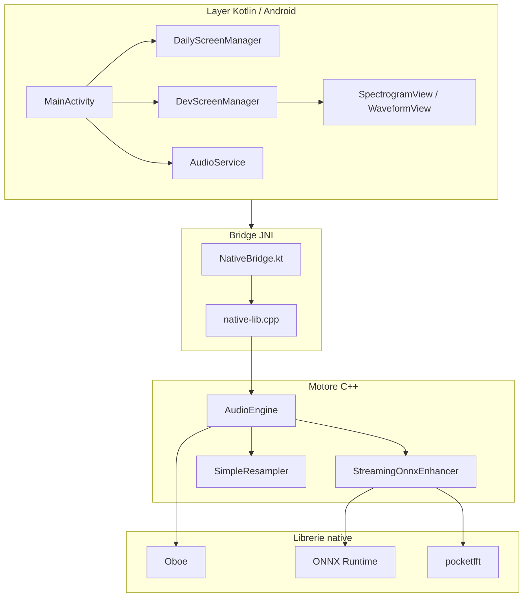
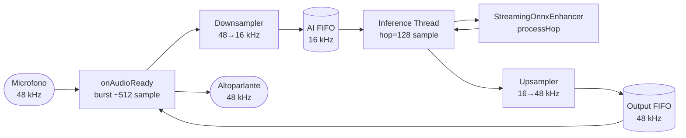
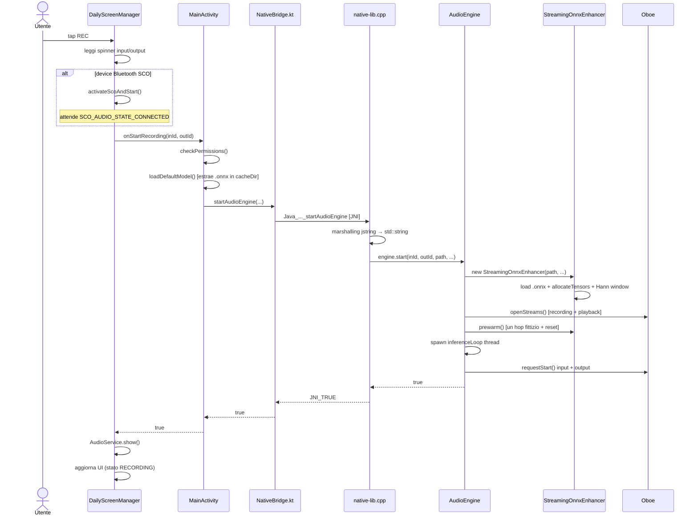
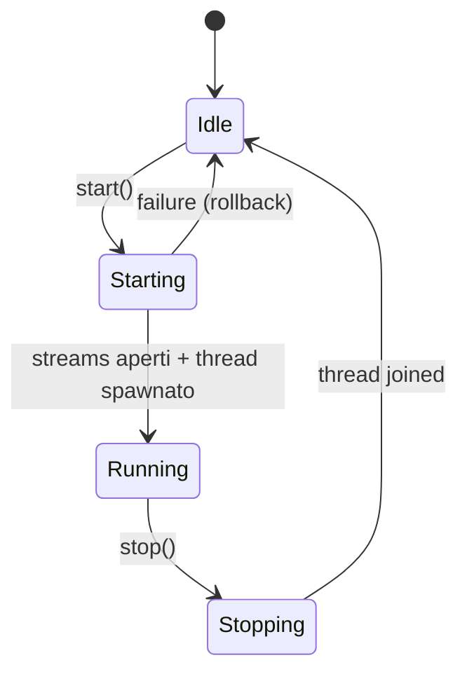
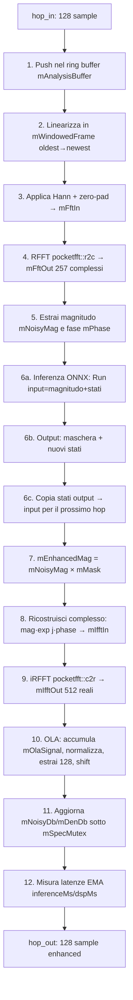
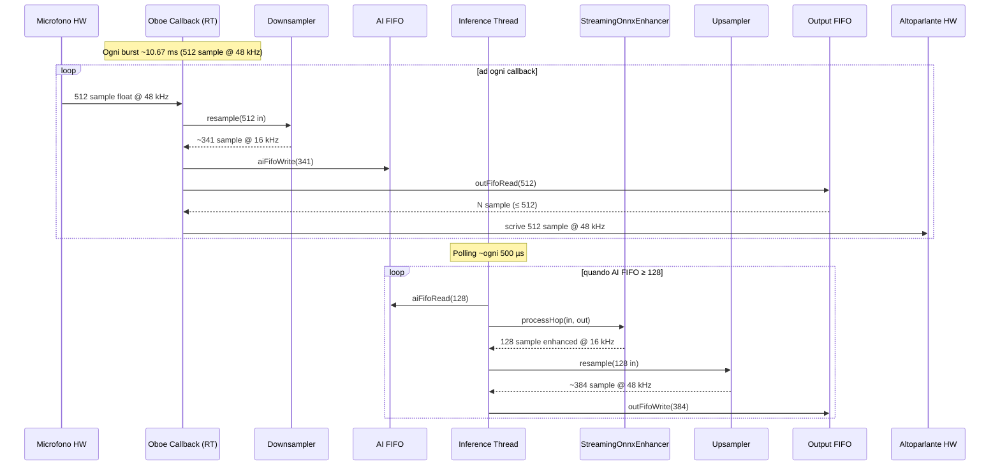

# MANUALE — Guida tecnica allo sviluppatore di SentoMeglio

> Una guida pensata per chi entra **adesso** nel progetto e in poche ore deve poter aprire qualunque file e capire cosa fa, perché esiste e come si lega al resto.

---

## Indice

1. [Introduzione](#1-introduzione)
2. [Architettura ad alto livello](#2-architettura-ad-alto-livello)
3. [La UI Android (Kotlin)](#3-la-ui-android-kotlin)
4. [Il bridge JNI: come la UI parla al C++](#4-il-bridge-jni-come-la-ui-parla-al-c)
5. [Il motore audio C++](#5-il-motore-audio-c)
6. [I buffer: perché esistono e come si usano](#6-i-buffer-perché-esistono-e-come-si-usano)
7. [Cosa succede in ogni ciclo di processamento](#7-cosa-succede-in-ogni-ciclo-di-processamento)
8. [Il viaggio dell'audio: dal microfono all'altoparlante](#8-il-viaggio-dellaudio-dal-microfono-allaltoparlante)
9. [Setup ONNX (PRIMA) e visualizzazione (DOPO)](#9-setup-onnx-prima-e-visualizzazione-dopo)
10. [Build & dipendenze](#10-build--dipendenze)
11. [Diagnostica e RTF](#11-diagnostica-e-rtf)
12. [Glossario](#12-glossario)

---

## 1. Introduzione

**SentoMeglio** è un'app Android di **speech enhancement in tempo reale**: cattura l'audio dal microfono, lo "ripulisce" facendo passare lo spettro di magnitudo attraverso una rete neurale (modello ONNX), e lo riproduce sull'altoparlante (o cuffie/Bluetooth) con la latenza più bassa possibile.

Esistono due modalità d'uso, alternabili dalle Impostazioni:

- **Daily** — UI semplice: spinner per scegliere ingresso/uscita, un pulsante REC, parametri STFT fissi (`nFft=512`, `hopLength=128`, `winLength=320`) e modello di default `High.onnx`.
- **Dev** — UI tecnica: parametri STFT editabili, scelta del modello fra quelli in `assets/`, console log e due spettrogrammi (input rumoroso vs output denoised) aggiornati a 100 ms.

L'audio continua anche **in background** grazie a un Foreground Service ([`AudioService.kt`](../android/app/src/main/java/com/sentomeglio/app/AudioService.kt)) — è la feature dell'ultimo commit (`feat: microphone works with app in background`).

### Mappa minima del repository

```
android/
├── app/
│   ├── src/main/
│   │   ├── AndroidManifest.xml
│   │   ├── assets/                 ← modelli .onnx (High, Slim + varianti _int8)
│   │   ├── java/com/sentomeglio/app/   ← codice Kotlin
│   │   └── cpp/                    ← codice C++ + ONNX Runtime headers/libs
│   └── build.gradle.kts
└── build.gradle.kts
docs/
└── MANUALE.md                      ← questo file
```

---

## 2. Architettura ad alto livello

Il sistema è organizzato in tre strati: la UI Kotlin chiama una thin layer JNI (`NativeBridge.kt` ↔ `native-lib.cpp`), che controlla un motore C++ (`AudioEngine`) basato su Oboe per l'I/O e su un modulo `StreamingOnnxEnhancer` che incapsula la pipeline DSP + inferenza ONNX.

### Diagramma 1 — Architettura a strati



### Diagramma 2 — Flusso dati end-to-end

Il microfono produce audio a frequenza hardware (tipicamente 48 kHz). Il modello ONNX lavora a 16 kHz. Quindi un downsampler comprime l'input, l'enhancer elabora a 16 kHz, e un upsampler ricostruisce a 48 kHz prima della riproduzione.



### Modello a due thread

Il vincolo cardine di Oboe è che il **callback audio real-time** (`onAudioReady`) non può bloccare, allocare memoria o prendere lock. Sarebbe quindi impossibile eseguirvi l'inferenza ONNX (variabile, costosa). Per disaccoppiare i due tempi:

- **Thread real-time Oboe** ([`AudioEngine.cpp:360-401`](../android/app/src/main/cpp/AudioEngine.cpp#L360-L401)) — chiamato dal sistema ad ogni burst (~10.67 ms a 48 kHz/512). Legge mic, fa downsampling, scrive nella **AI FIFO**, legge dalla **Output FIFO**, consegna allo speaker.
- **Thread worker di inferenza** ([`AudioEngine.cpp:319-355`](../android/app/src/main/cpp/AudioEngine.cpp#L319-L355)) — loop normale (può sleepare), priorità leggermente alzata. Aspetta `hopLength` sample dalla AI FIFO, chiama `processHop()`, fa upsampling, scrive nella Output FIFO.

I due thread comunicano attraverso **due ring buffer SPSC lock-free** (single producer / single consumer): nessun mutex sul percorso real-time.

---

## 3. La UI Android (Kotlin)

### 3.1 [`MainActivity.kt`](../android/app/src/main/java/com/sentomeglio/app/MainActivity.kt)

L'`Activity` di ingresso. In `onCreate` istanzia i due manager dei pannelli (Daily/Dev) e applica la modalità persistente:

```kotlin
// MainActivity.kt:44-58
dailyManager = DailyScreenManager(
    binding = binding.screenDaily,
    onStartRecording = { inputId, outputId -> startDailyAudio(inputId, outputId) },
    onStopRecording = {
        NativeBridge.stopAudioEngine()
        AudioService.dismiss(this)
    },
    onSettingsRequested = { openSettings() }
)

devManager = DevScreenManager(
    binding = binding.screenDev,
    onSettingsRequested = { openSettings() }
)
```

Il punto chiave è la callback `onStartRecording`: il `DailyScreenManager` non chiama direttamente JNI, ma delega all'`Activity` (che conosce i permessi e gli asset). Questa è la prima chiamata che porterà al motore C++:

```kotlin
// MainActivity.kt:110-121
private fun startDailyAudio(inputId: Int, outputId: Int): Boolean {
    if (!checkPermissions()) return false
    val modelPath = loadDefaultModel() ?: run {
        Toast.makeText(this, "Nessun modello ONNX trovato", Toast.LENGTH_SHORT).show()
        return false
    }
    return NativeBridge.startAudioEngine(
        inputId = inputId, outputId = outputId,
        modelPath = modelPath,
        nFft = 512, hopLength = 128, winLength = 320
    )
}
```

`loadDefaultModel()` ([`MainActivity.kt:123-134`](../android/app/src/main/java/com/sentomeglio/app/MainActivity.kt#L123-L134)) estrae `High.onnx` dagli `assets` nella `cacheDir` dell'app e ne ritorna il path assoluto: questo è ciò che si passa via JNI al C++ (ONNX Runtime carica i modelli da file, non da `InputStream`).

`checkPermissions()` chiede `RECORD_AUDIO` e (su Android 12+) `BLUETOOTH_CONNECT`. Se vengono concessi a runtime, `onRequestPermissionsResult` ritenta automaticamente `dailyManager.retryStartRecording()`.

Nota importante: in `onStop` **non** si ferma il motore — è il Foreground Service a tenerlo vivo:

```kotlin
// MainActivity.kt:168-173
override fun onStop() {
    super.onStop()
    dailyManager.onStop()
    devManager.onStop()
    // Do NOT stop audio here — the foreground service keeps it running in background.
}
```

### 3.2 [`DailyScreenManager.kt`](../android/app/src/main/java/com/sentomeglio/app/DailyScreenManager.kt)

Gestisce la UI semplice: due `Spinner` per scegliere ingresso/uscita, il pulsante REC, un timer, una `WaveformView` animata e un cerchio "pulse" che batte. Espone una macchina a stati `IDLE` / `RECORDING`.

I dispositivi audio supportati sono filtrati esplicitamente per tipo ([`DailyScreenManager.kt:53-71`](../android/app/src/main/java/com/sentomeglio/app/DailyScreenManager.kt#L53-L71)) — solo built-in mic/speaker, cuffie cablate, Bluetooth SCO, A2DP, USB e BLE.

Quando si preme REC, il flusso si biforca in base al tipo di device selezionato:

```kotlin
// DailyScreenManager.kt:213-223
private fun startRecording() {
    val inputItem = binding.inputSpinner.selectedItem as? AudioDeviceItem ?: return
    val outputItem = binding.outputSpinner.selectedItem as? AudioDeviceItem ?: return
    val needsSco = inputItem.type == AudioDeviceInfo.TYPE_BLUETOOTH_SCO ||
                   outputItem.type == AudioDeviceInfo.TYPE_BLUETOOTH_SCO
    if (needsSco) {
        activateScoAndStart(inputItem, outputItem)
    } else {
        doStart(inputItem, outputItem)
    }
}
```

Per Bluetooth SCO serve attivare la modalità di comunicazione del sistema, lanciare `startBluetoothSco()` e attendere il broadcast `SCO_AUDIO_STATE_CONNECTED` ([`DailyScreenManager.kt:237-276`](../android/app/src/main/java/com/sentomeglio/app/DailyScreenManager.kt#L237-L276)) prima di chiamare `doStart()`. C'è un timeout di 8 s per non bloccare la UI all'infinito.

`doStart()` invoca la callback `onStartRecording` (cioè `MainActivity.startDailyAudio`), e se l'engine parte, mostra il Foreground Service:

```kotlin
// DailyScreenManager.kt:225-235
private fun doStart(inputItem: AudioDeviceItem, outputItem: AudioDeviceItem) {
    val ok = onStartRecording(inputItem.id, outputItem.id)
    if (!ok) return
    AudioService.show(context)
    state = State.RECORDING
    setSpinnersEnabled(false)
    updateUi()
    startTimer()
    startPulse()
    binding.waveformView.setActive(true)
}
```

Un `AudioDeviceCallback` ([`DailyScreenManager.kt:77-96`](../android/app/src/main/java/com/sentomeglio/app/DailyScreenManager.kt#L77-L96)) si abbona alle aggiunte/rimozioni dinamiche dei dispositivi: se durante una registrazione viene scollegato il device attivo, il manager ferma il motore e mostra un Toast.

### 3.3 [`DevScreenManager.kt`](../android/app/src/main/java/com/sentomeglio/app/DevScreenManager.kt)

UI per sviluppatori: include scelta del modello, edit di `nFft/hop/win`, console log a 150 righe, e soprattutto **due spettrogrammi** aggiornati a 100 ms con magnitudo dB di input e output.

Il polling delle metriche è il blocco più interessante:

```kotlin
// DevScreenManager.kt:80-102
private val uiUpdater = object : Runnable {
    override fun run() {
        if (isPlaying) {
            val hwMs = NativeBridge.getHwLatencyMs()
            val inferMs = NativeBridge.getInferenceLatencyMs()
            val dspMs = NativeBridge.getDspLatencyMs()
            binding.latencyText.text = String.format(
                "HW: %.1f ms  |  DSP: %.2f ms  |  Infer: %.2f ms",
                hwMs, dspMs, inferMs
            )
            val frameBudgetMs = currentHopLength * 1000.0 / 16000.0
            val rtf = (dspMs + inferMs) / frameBudgetMs
            binding.metricsText.text = String.format("RTF: %.3f", rtf)
            val numFreqs = currentNFft / 2 + 1
            val noisyArray = FloatArray(numFreqs)
            val denArray = FloatArray(numFreqs)
            NativeBridge.getSpectrograms(noisyArray, denArray)
            binding.specIn.updateSpectrogram(noisyArray)
            binding.specDen.updateSpectrogram(denArray)
            handler.postDelayed(this, 100)
        }
    }
}
```

`RTF` (Real-Time Factor) = `(dsp + infer) / (hop / 16000)`. Se sta sotto 1, l'algoritmo elabora più velocemente di quanto l'audio scorra: real-time garantito.

Validazione dei parametri STFT ([`DevScreenManager.kt:289-295`](../android/app/src/main/java/com/sentomeglio/app/DevScreenManager.kt#L289-L295)): `nFft >= winLength` e `hopLength <= winLength`, altrimenti Toast e l'engine non parte.

### 3.4 [`AudioService.kt`](../android/app/src/main/java/com/sentomeglio/app/AudioService.kt)

Foreground Service di tipo `microphone` (vedi `AndroidManifest.xml:40`), serve a:

1. Tenere viva l'app in background (Android la ucciderebbe altrimenti).
2. Mostrare una notifica persistente con un'azione **Stop** che ferma l'engine.

Tre azioni distinte ([`AudioService.kt:46-67`](../android/app/src/main/java/com/sentomeglio/app/AudioService.kt#L46-L67)):

```kotlin
override fun onStartCommand(intent: Intent?, flags: Int, startId: Int): Int {
    when (intent?.action) {
        ACTION_SHOW -> {
            startForeground(NOTIF_ID, buildNotification())
            isRunning = true
        }
        ACTION_STOP -> {
            // Triggered by the notification Stop button — engine still running.
            NativeBridge.stopAudioEngine()
            isRunning = false
            stopForeground(STOP_FOREGROUND_REMOVE)
            stopSelf()
        }
        ACTION_DISMISS -> {
            // Triggered by app UI stop — engine already stopped by the manager.
            isRunning = false
            stopForeground(STOP_FOREGROUND_REMOVE)
            stopSelf()
        }
    }
    return START_NOT_STICKY
}
```

La differenza fra `ACTION_STOP` e `ACTION_DISMISS` è sottile ma fondamentale: il primo lo invoca la notifica (l'engine è ancora vivo, va fermato qui); il secondo lo invoca la UI (l'engine è già fermato dal manager).

`onTaskRemoved` gestisce il caso "swipe via dai recenti": ferma sia l'engine sia il service.

### 3.5 [`SpectrogramView.kt`](../android/app/src/main/java/com/sentomeglio/app/SpectrogramView.kt) e [`WaveformView.kt`](../android/app/src/main/java/com/sentomeglio/app/WaveformView.kt)

`SpectrogramView` mantiene un `Bitmap` ARGB di dimensioni `100 x numFreqs`, scrive una colonna per ogni `updateSpectrogram()` e tiene un cursore circolare `currentFrameIdx`. La colormap è una "magma-like" approssimata in 3 righe ([`SpectrogramView.kt:45-48`](../android/app/src/main/java/com/sentomeglio/app/SpectrogramView.kt#L45-L48)):

```kotlin
val r = (norm * 255).toInt()
val g = ((norm * norm) * 255).toInt()
val b = ((norm * norm * norm) * 255).toInt()
```

In `onDraw` disegna due rettangoli sorgente per "srotolare" il buffer circolare con scroll a destra.

`WaveformView` non legge audio reale — è puramente decorativa: 28 barre la cui altezza segue una somma di sinusoidi sfasate e viene smussata con un filtro IIR del primo ordine.

### 3.6 Permessi e [`AndroidManifest.xml`](../android/app/src/main/AndroidManifest.xml)

```xml
<uses-permission android:name="android.permission.RECORD_AUDIO" />
<uses-permission android:name="android.permission.BLUETOOTH" android:maxSdkVersion="30" />
<uses-permission android:name="android.permission.BLUETOOTH_CONNECT" />
<uses-permission android:name="android.permission.MODIFY_AUDIO_SETTINGS" />
<uses-permission android:name="android.permission.FOREGROUND_SERVICE" />
<uses-permission android:name="android.permission.FOREGROUND_SERVICE_MICROPHONE" />
```

Il `Service` è dichiarato con `foregroundServiceType="microphone"`: da Android 14 questo è obbligatorio per usare il microfono in background.

---

## 4. Il bridge JNI: come la UI parla al C++

Questa è la "cerniera" fra mondo Kotlin/JVM e mondo C++/native. Sono solo **due file**, ma è qui che il sistema vive o muore.

### 4.1 [`NativeBridge.kt`](../android/app/src/main/java/com/sentomeglio/app/NativeBridge.kt)

```kotlin
package com.sentomeglio.app

object NativeBridge {

    init {
        System.loadLibrary("onnxruntime")
        System.loadLibrary("app")
    }

    external fun startAudioEngine(
        inputId: Int, outputId: Int, modelPath: String,
        nFft: Int, hopLength: Int, winLength: Int
    ): Boolean

    external fun stopAudioEngine()
    external fun getInferenceLatencyMs(): Double
    external fun getDspLatencyMs(): Double
    external fun getHwLatencyMs(): Double
    external fun getSpectrograms(noisyDb: FloatArray, denDb: FloatArray)
}
```

Cose da notare:

- **`object`** (non `class`): è un singleton, esiste un'unica istanza nell'app. Coerente con il fatto che lato C++ esiste una `static AudioEngine engine;` di processo.
- **`init {}`**: alla prima referenza al singleton, vengono caricate `libonnxruntime.so` (deve precedere) e `libapp.so` (la nostra libreria nativa). L'ordine è critico: `libapp.so` linka simboli di `libonnxruntime.so`.
- **`external`**: la JVM cercherà a runtime un simbolo C nominato secondo la convenzione `Java_<package>_<class>_<funzione>`.

### 4.2 [`native-lib.cpp`](../android/app/src/main/cpp/native-lib.cpp)

Questo è il file dove i simboli JNI esistono. È volutamente sottile — non fa logica: marshalling dei tipi e delega a una `static AudioEngine engine;` di processo.

```cpp
#include "AudioEngine.h"
#include <jni.h>
#include <string>

static AudioEngine engine;

extern "C" JNIEXPORT jboolean JNICALL
Java_com_sentomeglio_app_NativeBridge_startAudioEngine(
    JNIEnv *env, jobject /* this */, jint inputId, jint outputId,
    jstring modelPath, jint nFft, jint hopLength, jint winLength)
{
  const char *nativeString = env->GetStringUTFChars(modelPath, 0);
  std::string path(nativeString);
  env->ReleaseStringUTFChars(modelPath, nativeString);
  return engine.start(inputId, outputId, path, nFft, hopLength, winLength)
             ? JNI_TRUE
             : JNI_FALSE;
}

extern "C" JNIEXPORT void JNICALL
Java_com_sentomeglio_app_NativeBridge_stopAudioEngine(JNIEnv *env, jobject) {
  engine.stop();
}
```

Il **marshalling** di `String → std::string` è il pattern classico: `GetStringUTFChars` ritorna un puntatore a buffer interno della JVM che bisogna **rilasciare** subito dopo aver copiato il contenuto.

`getSpectrograms` riceve due `FloatArray` Java pre-allocati e li popola con `SetFloatArrayRegion` ([`native-lib.cpp:48-66`](../android/app/src/main/cpp/native-lib.cpp#L48-L66)) — evita allocazioni JVM per chiamata, importante perché viene invocato 10 volte al secondo.

### 4.3 Mapping simboli — tabella di tutte le call site JNI

| Funzione Kotlin (`external`) | Simbolo C esportato | File / riga | Chi chiama in Kotlin |
|---|---|---|---|
| `startAudioEngine(...)` | `Java_com_sentomeglio_app_NativeBridge_startAudioEngine` | [`native-lib.cpp:7-18`](../android/app/src/main/cpp/native-lib.cpp#L7-L18) | [`MainActivity.kt:116`](../android/app/src/main/java/com/sentomeglio/app/MainActivity.kt#L116), [`DevScreenManager.kt:364`](../android/app/src/main/java/com/sentomeglio/app/DevScreenManager.kt#L364) |
| `stopAudioEngine()` | `Java_com_sentomeglio_app_NativeBridge_stopAudioEngine` | [`native-lib.cpp:20-25`](../android/app/src/main/cpp/native-lib.cpp#L20-L25) | [`MainActivity.kt:48`](../android/app/src/main/java/com/sentomeglio/app/MainActivity.kt#L48), [`AudioService.kt:54`](../android/app/src/main/java/com/sentomeglio/app/AudioService.kt#L54), [`AudioService.kt:71`](../android/app/src/main/java/com/sentomeglio/app/AudioService.kt#L71), [`DevScreenManager.kt:388`](../android/app/src/main/java/com/sentomeglio/app/DevScreenManager.kt#L388) |
| `getInferenceLatencyMs()` | `Java_com_sentomeglio_app_NativeBridge_getInferenceLatencyMs` | [`native-lib.cpp:27-32`](../android/app/src/main/cpp/native-lib.cpp#L27-L32) | [`DevScreenManager.kt:84`](../android/app/src/main/java/com/sentomeglio/app/DevScreenManager.kt#L84) |
| `getDspLatencyMs()` | `Java_com_sentomeglio_app_NativeBridge_getDspLatencyMs` | [`native-lib.cpp:34-39`](../android/app/src/main/cpp/native-lib.cpp#L34-L39) | [`DevScreenManager.kt:85`](../android/app/src/main/java/com/sentomeglio/app/DevScreenManager.kt#L85) |
| `getHwLatencyMs()` | `Java_com_sentomeglio_app_NativeBridge_getHwLatencyMs` | [`native-lib.cpp:41-46`](../android/app/src/main/cpp/native-lib.cpp#L41-L46) | [`DevScreenManager.kt:83`](../android/app/src/main/java/com/sentomeglio/app/DevScreenManager.kt#L83) |
| `getSpectrograms(...)` | `Java_com_sentomeglio_app_NativeBridge_getSpectrograms` | [`native-lib.cpp:48-66`](../android/app/src/main/cpp/native-lib.cpp#L48-L66) | [`DevScreenManager.kt:96`](../android/app/src/main/java/com/sentomeglio/app/DevScreenManager.kt#L96) |

### 4.4 Il viaggio di una chiamata: tap REC → engine.start()

### Diagramma 3 — Sequence diagram al tap REC



**Il punto sottile**: il thread di inferenza viene avviato **prima** dei flussi Oboe ([`AudioEngine.cpp:32-35`](../android/app/src/main/cpp/AudioEngine.cpp#L32-L35)). Così quando il primo callback arriva, il consumer è già in attesa sulla AI FIFO.

---

## 5. Il motore audio C++

### 5.1 [`AudioEngine.h`](../android/app/src/main/cpp/AudioEngine.h) — l'API pubblica

```cpp
class AudioEngine : public oboe::AudioStreamDataCallback,
                    public oboe::AudioStreamErrorCallback {
public:
    bool start(int inputDeviceId, int outputDeviceId,
               const std::string &modelPath, int nFft, int hopLength, int winLength);
    void stop();

    double getInferenceLatencyMs() const;
    double getDspLatencyMs() const;
    double getHwLatencyMs() const;
    void getSpectrograms(std::vector<float> &noisyDb, std::vector<float> &denDb);

    oboe::DataCallbackResult onAudioReady(oboe::AudioStream *audioStream,
                                          void *audioData, int32_t numFrames) override;
    void onErrorAfterClose(oboe::AudioStream *audioStream, oboe::Result error) override;
    // ...
};
```

Eredita due interfacce di Oboe: `onAudioReady` è il callback real-time, `onErrorAfterClose` viene chiamato se uno stream cade.

### 5.2 Ciclo di vita: `start()` / `stop()`

### Diagramma 4 — State diagram dell'engine



Il codice di `start()` segue rigorosamente questo ordine ([`AudioEngine.cpp:17-63`](../android/app/src/main/cpp/AudioEngine.cpp#L17-L63)):

```cpp
bool AudioEngine::start(int inputDeviceId, int outputDeviceId,
                        const std::string &modelPath, int nFft, int hopLength,
                        int winLength)
{
    mEnhancer = std::make_unique<StreamingOnnxEnhancer>(
        modelPath, mAiRate, nFft, hopLength, winLength);

    if (!openStreams(inputDeviceId, outputDeviceId, hopLength)) {
        mEnhancer.reset();
        return false;
    }

    mEnhancer->prewarm();

    // Start inference thread before streams so it's already running when the
    // first hops arrive from the callback.
    mInferenceRunning.store(true, std::memory_order_relaxed);
    mInferenceThread = std::thread(&AudioEngine::inferenceLoop, this);

    oboe::Result result = mRecordingStream->requestStart();
    // ... gestione errore: ferma thread, chiude stream, reset enhancer
    result = mPlaybackStream->requestStart();
    // ...
}
```

`stop()` è simmetrico: chiude gli stream (così il callback non viene più chiamato), poi segnala `mInferenceRunning = false` e fa `join` sul worker.

### 5.3 Apertura degli stream Oboe

In `openStreams()` ([`AudioEngine.cpp:118-235`](../android/app/src/main/cpp/AudioEngine.cpp#L118-L235)) si configurano due stream Oboe in **modalità Exclusive + LowLatency**:

```cpp
// AudioEngine.cpp:124-131
oboe::AudioStreamBuilder inBuilder;
inBuilder.setDirection(oboe::Direction::Input)
    ->setFormat(oboe::AudioFormat::Float)
    ->setChannelCount(1)
    ->setDeviceId(inputDeviceId)
    ->setPerformanceMode(oboe::PerformanceMode::LowLatency)
    ->setSharingMode(oboe::SharingMode::Exclusive)
    ->setSampleRateConversionQuality(oboe::SampleRateConversionQuality::Medium);
```

Il sample rate non si forza per l'input: si lascia decidere a Oboe (in pratica ottiene 48 kHz quasi sempre) e poi lo si **legge** con `getSampleRate()`. Per l'output si forza lo stesso `mHwRate`, così entrambi gli stream girano alla stessa frequenza.

Subito dopo aver aperto la playback, si stringe il buffer al minimo (1 burst):

```cpp
// AudioEngine.cpp:171-172
int32_t burst = mPlaybackStream->getFramesPerBurst();
mPlaybackStream->setBufferSizeInFrames(burst);
```

Questo è il limite minimo per LowLatency Exclusive. Se il driver non lo accetta, la chiamata viene clampata.

I resampler vengono creati solo se `mHwRate != mAiRate` (cioè quasi sempre, dato che AI gira a 16 kHz):

```cpp
// AudioEngine.cpp:181-190
if (mHwRate != mAiRate) {
    mDownsampler = std::make_unique<SimpleResampler>(mHwRate, mAiRate);
    mUpsampler = std::make_unique<SimpleResampler>(mAiRate, mHwRate);
} else {
    mDownsampler.reset();
    mUpsampler.reset();
}
```

### 5.4 [`SimpleResampler`](../android/app/src/main/cpp/SimpleResampler.cpp) — interpolazione lineare

L'implementazione è un resampler lineare classico stato-pieno (memorizza `mPhase` e `mLastSample` per la continuità tra chiamate):

```cpp
// SimpleResampler.cpp:21-37
int outIndex = 0;
double phaseInc = (double)mInRate / mOutRate;

while (true) {
    int inIndex = (int)std::floor(mPhase);
    if (inIndex >= inputFrames - 1) break;

    double frac = mPhase - inIndex;
    float s1 = (inIndex < 0) ? mLastSample : input[inIndex];
    float s2 = input[inIndex + 1];

    output[outIndex++] = s1 + (s2 - s1) * (float)frac;
    mPhase += phaseInc;
}

mLastSample = input[inputFrames - 1];
mPhase -= inputFrames;
```

Per 48→16 kHz: `phaseInc = 3.0`, in pratica un sample ogni tre. Per 16→48: `phaseInc = 0.333…`. La qualità è modesta ma il costo in CPU è trascurabile.

### 5.5 I due thread in dettaglio

**Thread real-time Oboe** ([`AudioEngine.cpp:360-401`](../android/app/src/main/cpp/AudioEngine.cpp#L360-L401)) — chiamato dal sistema con il buffer da riempire:

```cpp
oboe::DataCallbackResult AudioEngine::onAudioReady(oboe::AudioStream *,
                                                   void *audioData,
                                                   int32_t numFrames)
{
    float *out = static_cast<float *>(audioData);
    if (!mRecordingStream) {
        std::memset(out, 0, numFrames * sizeof(float));
        return oboe::DataCallbackResult::Continue;
    }

    // 1. Read from microphone (timeout 0 = non-blocking)
    auto res = mRecordingStream->read(mInputBuffer.data(), numFrames, 0);
    int32_t framesRead = (res && res.value() > 0) ? res.value() : 0;
    if (framesRead < numFrames) {
        std::memset(mInputBuffer.data() + framesRead, 0,
                    (numFrames - framesRead) * sizeof(float));
    }

    // 2. Downsample → AI FIFO
    if (mDownsampler) {
        int n = mDownsampler->resample(mInputBuffer.data(), numFrames, mAiBuffer.data());
        aiFifoWrite(mAiBuffer.data(), n);
    } else {
        aiFifoWrite(mInputBuffer.data(), numFrames);
    }

    // 3. Read processed audio from output FIFO → speaker
    int got = outFifoRead(out, numFrames);
    if (got < numFrames) {
        std::memset(out + got, 0, (numFrames - got) * sizeof(float));
    }
    return oboe::DataCallbackResult::Continue;
}
```

I 3 numeri da ricordare: il callback **legge dal mic** (`read`), **scrive in AI FIFO** (downsamplato), **legge da Output FIFO** (verso speaker). Niente lock, niente malloc, niente sleep.

**Thread worker di inferenza** ([`AudioEngine.cpp:319-355`](../android/app/src/main/cpp/AudioEngine.cpp#L319-L355)):

```cpp
void AudioEngine::inferenceLoop()
{
    setpriority(PRIO_PROCESS, 0, -8);  // priorità un po' più alta del normale

    while (mInferenceRunning.load(std::memory_order_relaxed)) {
        if (mAiFifoCount.load(std::memory_order_acquire) < mHopLength) {
            std::this_thread::sleep_for(std::chrono::microseconds(500));
            continue;
        }

        aiFifoRead(mHopBuffer.data(), mHopLength);

        if (mEnhancer) {
            mEnhancer->processHop(mHopBuffer.data(), mHopOutBuffer.data());
        } else {
            std::memcpy(mHopOutBuffer.data(), mHopBuffer.data(), mHopLength * sizeof(float));
        }

        if (mUpsampler) {
            int n = mUpsampler->resample(mHopOutBuffer.data(), mHopLength, mTempOut.data());
            outFifoWrite(mTempOut.data(), n);
        } else {
            outFifoWrite(mHopOutBuffer.data(), mHopLength);
        }
    }
}
```

Qui si può sleepare. Il polling con `sleep_for(500us)` è un compromesso fra reattività e CPU bruciata: il hop dura 8 ms, perdere mezzo millisecondo è il 6% del budget. Con una `condition_variable` si abbatterebbe ulteriormente, a costo di più complessità — non vale la pena.

**Fallback**: se `mEnhancer` non è valido (ad esempio modello che non si è caricato), passthrough diretto. L'audio passa "non elaborato" e l'app non crasha.

---

## 6. I buffer: perché esistono e come si usano

Questa sezione è il cuore di chi vuole capire **davvero** il flusso. Tutti i buffer — uno per uno.

### 6.1 Mappa completa

| Buffer | File / dichiarazione | Tipo | Dimensione tipica | Owner | Lettore | Cosa contiene |
|---|---|---|---|---|---|---|
| `mInputBuffer` | [`AudioEngine.h:40`](../android/app/src/main/cpp/AudioEngine.h#L40) | `vector<float>` | ≥ 4096 | callback | callback | Sample mic @ 48 kHz |
| `mAiBuffer` | [`AudioEngine.h:41`](../android/app/src/main/cpp/AudioEngine.h#L41) | `vector<float>` | ≥ 4096 | callback | callback | Sample mic downsamplati @ 16 kHz |
| `mAiFifo` | [`AudioEngine.h:55`](../android/app/src/main/cpp/AudioEngine.h#L55) | ring buffer SPSC | 8 × maxAiFrames | callback (write) | inferenza (read) | Coda audio AI in attesa di processHop |
| `mOutputFifo` | [`AudioEngine.h:46`](../android/app/src/main/cpp/AudioEngine.h#L46) | ring buffer SPSC | 16 × hopHwFrames | inferenza (write) | callback (read) | Audio elaborato @ 48 kHz pronto per HW |
| `mHopBuffer` | [`AudioEngine.h:62`](../android/app/src/main/cpp/AudioEngine.h#L62) | `vector<float>` | `hopLength` (128) | inferenza | inferenza | Un hop appena letto dalla AI FIFO |
| `mHopOutBuffer` | [`AudioEngine.h:63`](../android/app/src/main/cpp/AudioEngine.h#L63) | `vector<float>` | `hopLength` (128) | inferenza | inferenza | Un hop elaborato @ 16 kHz |
| `mTempOut` | [`AudioEngine.h:64`](../android/app/src/main/cpp/AudioEngine.h#L64) | `vector<float>` | `(hop·hw/ai)+4` | inferenza | inferenza | Hop dopo upsampling, prima di Output FIFO |
| `mAnalysisBuffer` | [`StreamingOnnxEnhancer.h:45`](../android/app/src/main/cpp/StreamingOnnxEnhancer.h#L45) | ring buffer | `winLength` (320 / 512) | enhancer | enhancer | Finestra di analisi rotante |
| `mWindowedFrame` | [`StreamingOnnxEnhancer.h:48`](../android/app/src/main/cpp/StreamingOnnxEnhancer.h#L48) | `vector<float>` | `winLength` | enhancer | enhancer | `mAnalysisBuffer` linearizzato |
| `mWindow` | [`StreamingOnnxEnhancer.h:42`](../android/app/src/main/cpp/StreamingOnnxEnhancer.h#L42) | `vector<float>` | `winLength` | costruttore | enhancer | Finestra Hann pre-calcolata |
| `mWindowSq` | [`StreamingOnnxEnhancer.h:43`](../android/app/src/main/cpp/StreamingOnnxEnhancer.h#L43) | `vector<float>` | `winLength` | costruttore | enhancer | Hann al quadrato (per OLA norm) |
| `mFftIn` | [`StreamingOnnxEnhancer.h:71`](../android/app/src/main/cpp/StreamingOnnxEnhancer.h#L71) | `vector<float>` | `nFft` (512) | enhancer | enhancer | Frame finestrato + zero-pad → input RFFT |
| `mFftOut` | [`StreamingOnnxEnhancer.h:72`](../android/app/src/main/cpp/StreamingOnnxEnhancer.h#L72) | `vector<complex<float>>` | `nBins` (257) | enhancer | enhancer | Output RFFT |
| `mNoisyMag` | [`StreamingOnnxEnhancer.h:61`](../android/app/src/main/cpp/StreamingOnnxEnhancer.h#L61) | `vector<float>` | `nBins` | enhancer | enhancer + ONNX | Magnitudo di `mFftOut` (anche tensor input!) |
| `mPhase` | [`StreamingOnnxEnhancer.h:62`](../android/app/src/main/cpp/StreamingOnnxEnhancer.h#L62) | `vector<float>` | `nBins` | enhancer | enhancer | Fase di `mFftOut` (preservata per iSTFT) |
| `mMask` | [`StreamingOnnxEnhancer.h:64`](../android/app/src/main/cpp/StreamingOnnxEnhancer.h#L64) | `vector<float>` | `nBins` | enhancer | enhancer | Maschera spettrale prodotta dal modello |
| `mEnhancedMag` | [`StreamingOnnxEnhancer.h:63`](../android/app/src/main/cpp/StreamingOnnxEnhancer.h#L63) | `vector<float>` | `nBins` | enhancer | enhancer | `mNoisyMag * mMask` |
| `mIfftIn` | [`StreamingOnnxEnhancer.h:73`](../android/app/src/main/cpp/StreamingOnnxEnhancer.h#L73) | `vector<complex<float>>` | `nBins` | enhancer | enhancer | Spettro complesso ricostruito |
| `mIfftOut` | [`StreamingOnnxEnhancer.h:74`](../android/app/src/main/cpp/StreamingOnnxEnhancer.h#L74) | `vector<float>` | `nFft` | enhancer | enhancer | Output iRFFT (frame nel tempo) |
| `mOlaSignal` | [`StreamingOnnxEnhancer.h:49`](../android/app/src/main/cpp/StreamingOnnxEnhancer.h#L49) | `vector<float>` | `winLength` | enhancer | enhancer | Accumulatore Overlap-Add |
| `mOlaNorm` | [`StreamingOnnxEnhancer.h:50`](../android/app/src/main/cpp/StreamingOnnxEnhancer.h#L50) | `vector<float>` | `winLength` | enhancer | enhancer | Somma dei quadrati della finestra (per normalizzare OLA) |
| `mStateBacking` | [`StreamingOnnxEnhancer.h:59`](../android/app/src/main/cpp/StreamingOnnxEnhancer.h#L59) | `vector<vector<float>>` | dipende dal modello | enhancer | enhancer + ONNX | Stati ricorrenti (GRU/LSTM) |
| `mNoisyDb` / `mDenDb` | [`StreamingOnnxEnhancer.h:68-69`](../android/app/src/main/cpp/StreamingOnnxEnhancer.h#L68-L69) | `vector<float>` | `nBins` | enhancer (write under mutex) | UI thread (read) | Spettrogrammi dB per visualizzazione |

### 6.2 Perché tre famiglie di buffer

I buffer non sono tutti uguali: la loro categoria racconta il **vincolo di concorrenza** che li ha generati.

**Famiglia 1 — Buffer "scratch" privati di un thread**.
`mInputBuffer`, `mAiBuffer` (privati del callback). `mHopBuffer`, `mHopOutBuffer`, `mTempOut`, e tutti quelli dell'`enhancer` (privati del worker). Pre-allocati in `start()` o nel costruttore, mai ridimensionati a runtime per non chiamare `malloc` durante il processing. Nessun lock perché un solo thread li tocca.

**Famiglia 2 — Ring buffer SPSC**.
`mAiFifo` e `mOutputFifo`. Sono il **canale di comunicazione** fra i due thread. Lock-free perché un solo produttore e un solo consumatore — il pattern SPSC ammette implementazioni atomiche.

**Famiglia 3 — Buffer protetti da mutex**.
Solo `mNoisyDb` e `mDenDb`, perché letti dal thread UI a 100 ms. Il mutex è preso solo per la copia (poche centinaia di byte), durata trascurabile rispetto al periodo del callback.

### 6.3 SPSC FIFO lock-free in dettaglio

L'implementazione è la stessa per le due FIFO. Snippet della Output FIFO ([`AudioEngine.cpp:259-286`](../android/app/src/main/cpp/AudioEngine.cpp#L259-L286)):

```cpp
void AudioEngine::outFifoWrite(const float *data, int count)
{
    int space = mFifoCapacity - mFifoCount.load(std::memory_order_acquire);
    int n = std::min(count, space);
    for (int i = 0; i < n; ++i) {
        mOutputFifo[mFifoWriteIdx] = data[i];
        if (++mFifoWriteIdx == mFifoCapacity)
            mFifoWriteIdx = 0;
    }
    if (n > 0)
        mFifoCount.fetch_add(n, std::memory_order_release);
}

int AudioEngine::outFifoRead(float *data, int count)
{
    int avail = mFifoCount.load(std::memory_order_acquire);
    int n = std::min(count, avail);
    for (int i = 0; i < n; ++i) {
        data[i] = mOutputFifo[mFifoReadIdx];
        if (++mFifoReadIdx == mFifoCapacity)
            mFifoReadIdx = 0;
    }
    if (n > 0)
        mFifoCount.fetch_sub(n, std::memory_order_release);
    return n;
}
```

Tre cose da notare:

1. **`mFifoReadIdx` e `mFifoWriteIdx` non sono atomici** — ognuno è di proprietà esclusiva di un solo thread (read del consumer, write del producer). Non serve sincronizzarli.
2. **`mFifoCount` è atomico** — pubblica al consumer "ho aggiunto N sample" e al producer "ho consumato N sample". Le memory order `acquire` (sul `load`) e `release` (sul `fetch_add/sub`) garantiscono che le scritture nei sample siano visibili **prima** che il counter cambi.
3. **Backpressure**: se la FIFO è piena, il producer scrive solo quanto può; se è vuota, il consumer legge solo quanto può. Il chiamante deve gestire i casi di "scarsità" (vedi underrun nel callback).

### 6.4 Il pre-fill della Output FIFO — perché esiste

Subito dopo aver aperto gli stream, l'engine fa una cosa apparentemente strana: riempie la Output FIFO con un hop di silenzio.

```cpp
// AudioEngine.cpp:220-226
// Pre-fill with 1 hop of silence — minimum cushion against the first-hop
// jitter while keeping algorithmic latency low. The ONNX model is also
// pre-warmed in start() before streams begin so the first real Run() does
// not pay model-load cost.
int preFill = std::min(hopHwFrames, mFifoCapacity);
mFifoWriteIdx = preFill;
mFifoCount.store(preFill, std::memory_order_relaxed);
```

Perché? Pensa al primo callback Oboe: il sistema lo chiama e si aspetta `numFrames` di audio in uscita. Ma la pipeline non ha ancora prodotto nulla — il worker deve prima accumulare `hopLength` sample dalla AI FIFO, poi processarli, poi farne upsampling, poi scrivere. Senza pre-fill, il primo callback troverebbe la Output FIFO vuota: `outFifoRead` ritornerebbe 0, il callback farebbe un memset di zero — **click udibile** all'inizio di ogni sessione.

Riempire con un hop di silenzio (≈8 ms a 16 kHz, ≈24 ms a 48 kHz) dà al worker il tempo di "rincorrere". È il **costo minimo** in termini di latenza: il prezzo della robustezza al jitter di startup.

### 6.5 Il ring buffer di analisi `mAnalysisBuffer`

L'enhancer riceve `hopLength=128` sample alla volta, ma per fare la STFT serve una finestra di `winLength=320` sample (o 512 in dev mode). Servono quindi **gli ultimi `winLength` sample**, ovvero `winLength - hopLength` sample dei hop precedenti più i 128 nuovi.

Soluzione classica: ring buffer circolare di dimensione `winLength` con write index. Push del nuovo hop ([`StreamingOnnxEnhancer.cpp:118-127`](../android/app/src/main/cpp/StreamingOnnxEnhancer.cpp#L118-L127)):

```cpp
int end = mAnalysisWriteIdx + mHopLength;
if (end <= mWinLength) {
    std::memcpy(&mAnalysisBuffer[mAnalysisWriteIdx], hop_in, mHopLength * sizeof(float));
} else {
    int split = mWinLength - mAnalysisWriteIdx;
    std::memcpy(&mAnalysisBuffer[mAnalysisWriteIdx], hop_in, split * sizeof(float));
    std::memcpy(&mAnalysisBuffer[0], hop_in + split, (mHopLength - split) * sizeof(float));
}
mAnalysisWriteIdx = end % mWinLength;
```

Poi servono i sample in ordine cronologico (oldest → newest) per applicare correttamente la finestra. Si linearizza in `mWindowedFrame` ([`StreamingOnnxEnhancer.cpp:130-136`](../android/app/src/main/cpp/StreamingOnnxEnhancer.cpp#L130-L136)):

```cpp
if (mAnalysisWriteIdx == 0) {
    std::memcpy(mWindowedFrame.data(), mAnalysisBuffer.data(), mWinLength * sizeof(float));
} else {
    int tail = mWinLength - mAnalysisWriteIdx;
    std::memcpy(mWindowedFrame.data(), &mAnalysisBuffer[mAnalysisWriteIdx], tail * sizeof(float));
    std::memcpy(mWindowedFrame.data() + tail, mAnalysisBuffer.data(), mAnalysisWriteIdx * sizeof(float));
}
```

### 6.6 Gli accumulatori OLA: `mOlaSignal` e `mOlaNorm`

Dopo l'iRFFT, abbiamo `mIfftOut` lungo `nFft` (es. 512), che rappresenta la **stima nel tempo** del frame corrente. Ma i frame si **sovrappongono**: ogni hop in più produce un frame nuovo che si somma in parte agli ultimi `winLength - hopLength` sample del frame precedente.

`mOlaSignal` accumula questa somma. `mOlaNorm` accumula la somma dei quadrati della finestra, per normalizzare correttamente (è la **condizione COLA** — Constant Overlap-Add — che garantisce ricostruzione perfetta di un segnale identitario).

```cpp
// StreamingOnnxEnhancer.cpp:201-213
for (int i = 0; i < mWinLength; ++i) {
    mOlaSignal[i] += mIfftOut[i] * mWindow[i];
    mOlaNorm[i]   += mWindowSq[i];
}
for (int i = 0; i < mHopLength; ++i) {
    hop_out[i] = mOlaSignal[i] / std::max(mOlaNorm[i], 1e-8f);
}

int remaining = mWinLength - mHopLength;
std::memmove(mOlaSignal.data(), mOlaSignal.data() + mHopLength, remaining * sizeof(float));
std::memset(mOlaSignal.data() + remaining, 0, mHopLength * sizeof(float));
std::memmove(mOlaNorm.data(), mOlaNorm.data() + mHopLength, remaining * sizeof(float));
std::memset(mOlaNorm.data() + remaining, 0, mHopLength * sizeof(float));
```

Sequenza:

1. **Accumula** il frame corrente sopra l'accumulatore (con un'altra finestra Hann — **synthesis window**).
2. **Estrae** i primi `hopLength` sample dell'accumulatore (sono "completi" ora, non riceveranno più contributi futuri) e li normalizza.
3. **Shifta** l'accumulatore di `hopLength` posizioni a sinistra: i sample appena emessi escono, gli `hopLength` finali si azzerano (pronti a ricevere il contributo del prossimo iRFFT).

L'`max(mOlaNorm[i], 1e-8f)` evita divisione per zero ai bordi, dove la finestra è quasi nulla.

### 6.7 `mStateBacking` — il filo di Arianna del modello ricorrente

I modelli ONNX usati qui sono **ricorrenti**: hanno input/output di stato (GRU/LSTM hidden states) che vanno ri-iniettati al hop successivo. Lato C++, questi stati vivono in `mStateBacking` (un vettore di vettori di float, uno per ogni input di stato del modello).

In `allocateTensors()` ([`StreamingOnnxEnhancer.cpp:84-97`](../android/app/src/main/cpp/StreamingOnnxEnhancer.cpp#L84-L97)) si guardano i nomi degli input del modello: quello chiamato `frame` o `input` viene wrappato direttamente attorno a `mNoisyMag.data()` (zero-copy, vedi 7.5); tutti gli altri sono stati, allocati in `mStateBacking`:

```cpp
} else {
    Ort::TypeInfo type_info = mSession->GetInputTypeInfo(i);
    auto tensor_info = type_info.GetTensorTypeAndShapeInfo();
    std::vector<int64_t> dims = tensor_info.GetShape();
    for (auto& d : dims) { if (d < 0) d = 1; }

    size_t tensor_size = 1;
    for (auto d : dims) tensor_size *= (size_t)d;

    mStateBacking.emplace_back(tensor_size, 0.0f);
    float* ptr = mStateBacking.back().data();
    mInputTensors.push_back(Ort::Value::CreateTensor<float>(
        mMemoryInfo, ptr, tensor_size, dims.data(), dims.size()));
}
```

Dopo ogni `Run()`, gli output di stato vengono **copiati** dentro gli input ([`StreamingOnnxEnhancer.cpp:175-181`](../android/app/src/main/cpp/StreamingOnnxEnhancer.cpp#L175-L181)):

```cpp
for (size_t i = 1; i < mInputTensors.size(); ++i) {
    float* out_ptr = output_tensors[i].GetTensorMutableData<float>();
    float* in_ptr  = mInputTensors[i].GetTensorMutableData<float>();
    size_t count   = mInputTensors[i].GetTensorTypeAndShapeInfo().GetElementCount();
    std::memcpy(in_ptr, out_ptr, count * sizeof(float));
}
```

`prewarm()` ([`StreamingOnnxEnhancer.cpp:238-256`](../android/app/src/main/cpp/StreamingOnnxEnhancer.cpp#L238-L256)) azzera questi stati: il modello riparte da zero ad ogni `start()`.

---

## 7. Cosa succede in ogni ciclo di processamento

Ogni "ciclo" del worker = una chiamata a `processHop()`. A 16 kHz con `hopLength=128`, un hop dura **8 ms**. Il worker tira un nuovo hop dalla AI FIFO ogni volta che ce ne sono almeno 128 sample disponibili.

Tutta la logica vive in [`StreamingOnnxEnhancer.cpp:112-230`](../android/app/src/main/cpp/StreamingOnnxEnhancer.cpp#L112-L230). Vediamo i 12 step in ordine.

### Diagramma 5 — Flowchart di `processHop()`



### Step 1 — Push nel ring buffer di analisi

Già visto in 6.5. Il nuovo hop entra in `mAnalysisBuffer` alla posizione `mAnalysisWriteIdx`, gestendo il wrap.

### Step 2 — Linearizzazione

Ricostruisce in `mWindowedFrame` l'ordine cronologico (oldest → newest). Questo è il frame "storico" su cui calcolare la finestra.

### Step 3 — Finestratura Hann + zero-pad

```cpp
// StreamingOnnxEnhancer.cpp:140-143
std::memset(mFftIn.data(), 0, mNFft * sizeof(float));
for (int i = 0; i < mWinLength; ++i) {
    mFftIn[i] = mWindowedFrame[i] * mWindow[i];
}
```

`mFftIn` è lungo `nFft` (512); i primi `winLength` (320 in Daily, 512 in Dev) sono dati finestrati, il resto è zero. Lo zero-padding aumenta la **risoluzione interpolata** in frequenza senza aumentare l'informazione utile.

La Hann window è precalcolata nel costruttore ([`StreamingOnnxEnhancer.cpp:21-28`](../android/app/src/main/cpp/StreamingOnnxEnhancer.cpp#L21-L28)):

```cpp
for (int i = 0; i < mWinLength; ++i) {
    float w = 0.5f * (1.0f - std::cos(2.0f * M_PI * i / (mWinLength - 1.0f)));
    mWindow[i] = w;
    mWindowSq[i] = w * w;
}
```

### Step 4 — RFFT (Real FFT)

Trasformata reale → complessa via [`pocketfft`](../android/app/src/main/cpp/pocketfft_hdronly.h):

```cpp
// StreamingOnnxEnhancer.cpp:146-150
shape_t  shape_in   = {(size_t)mNFft};
stride_t stride_in  = {sizeof(float)};
stride_t stride_out = {sizeof(std::complex<float>)};
pocketfft::r2c(shape_in, stride_in, stride_out, {0}, true,
               mFftIn.data(), mFftOut.data(), 1.0f);
```

Output `mFftOut` ha `nBins = nFft/2 + 1 = 257` valori complessi (lo spettro positivo di un segnale reale è simmetrico — basta metà più il bin DC e Nyquist).

### Step 5 — Magnitudo e fase

```cpp
// StreamingOnnxEnhancer.cpp:153-158
for (int i = 0; i < mNBins; ++i) {
    float r  = mFftOut[i].real();
    float im = mFftOut[i].imag();
    mNoisyMag[i] = std::sqrt(r * r + im * im);
    mPhase[i]    = std::atan2(im, r);
}
```

Il segnale viene **scomposto**: la rete neurale lavora **solo sulla magnitudo** (è ciò che il modello è stato addestrato a riconoscere), la fase viene **conservata** intatta per la ricostruzione (step 8). Questo è il pattern classico dei "magnitude-only enhancer".

### Step 6 — Inferenza ONNX (il cuore di tutto)

```cpp
// StreamingOnnxEnhancer.cpp:163-181
auto inf_start = std::chrono::high_resolution_clock::now();
auto output_tensors = mSession->Run(
    Ort::RunOptions{nullptr},
    mInputNames.data(), mInputTensors.data(), mInputTensors.size(),
    mOutputNames.data(), mOutputNames.size());
auto inf_end = std::chrono::high_resolution_clock::now();

double raw = std::chrono::duration<double, std::milli>(inf_end - inf_start).count();
mLastInferenceMs.store(raw);
double prev = mInferenceEmaMs.load();
mInferenceEmaMs.store(prev == 0.0 ? raw : kEmaAlpha * raw + (1.0 - kEmaAlpha) * prev);

// Update recurrent states (output[1..N] → input[1..N])
for (size_t i = 1; i < mInputTensors.size(); ++i) {
    float* out_ptr = output_tensors[i].GetTensorMutableData<float>();
    float* in_ptr  = mInputTensors[i].GetTensorMutableData<float>();
    size_t count   = mInputTensors[i].GetTensorTypeAndShapeInfo().GetElementCount();
    std::memcpy(in_ptr, out_ptr, count * sizeof(float));
}
```

Cose importanti:

- L'input principale è già stato aggiornato **automaticamente** allo Step 5: il tensore wrappa direttamente `mNoisyMag.data()` (zero-copy), quindi quando si modifica `mNoisyMag` si modifica l'input del modello.
- L'EMA delle latenze (α = 0.1, vedi `kEmaAlpha`) smussa rumore di misura per mostrarle stabili in UI.
- Il loop sugli stati funziona così: l'output `i` del modello al hop `n` diventa l'input `i` al hop `n+1`. È la **memoria a breve termine** della rete (una GRU tipica).

### Step 7 — Applicazione della maschera

```cpp
// StreamingOnnxEnhancer.cpp:184-188
float* mask_ptr = output_tensors[0].GetTensorMutableData<float>();
for (int i = 0; i < mNBins; ++i) {
    mMask[i]        = mask_ptr[i];
    mEnhancedMag[i] = mNoisyMag[i] * mMask[i];
}
```

La maschera è nello stesso "spazio" della magnitudo (stessi 257 bin). Moltiplicandola bin per bin si attenuano i bin di rumore (mask vicina a 0) e si conservano quelli di voce (mask vicina a 1). Questa è la **forma più semplice** di mask spectral subtraction; modelli più sofisticati potrebbero produrre maschere complesse, ma qui siamo nel paradigma "magnitude-only".

### Step 8 — Ricostruzione dello spettro complesso

```cpp
// StreamingOnnxEnhancer.cpp:192-196
for (int i = 0; i < mNBins; ++i) {
    mIfftIn[i] = std::complex<float>(
        mEnhancedMag[i] * std::cos(mPhase[i]),
        mEnhancedMag[i] * std::sin(mPhase[i]));
}
```

Si fonde la **magnitudo enhanced** (output del modello) con la **fase originale** (preservata dallo Step 5). Equivale a `mEnhancedMag · exp(j·mPhase)`. Il fatto di non toccare la fase è una scelta di robustezza: la fase è notoriamente difficile da modellare e modificarla introduce facilmente artefatti.

### Step 9 — iRFFT

```cpp
// StreamingOnnxEnhancer.cpp:197-198
pocketfft::c2r(shape_in, stride_out, stride_in, {0}, false,
               mIfftIn.data(), mIfftOut.data(), 1.0f / mNFft);
```

Il fattore di scaling `1/nFft` compensa la convenzione FFT (nessuna normalizzazione interna in pocketfft).

### Step 10 — Overlap-Add

Già visto nel dettaglio in 6.6. È il passaggio che trasforma una sequenza di frame sovrapposti in un segnale **continuo nel tempo**.

### Step 11 — Aggiornamento spettrogrammi per UI

```cpp
// StreamingOnnxEnhancer.cpp:222-229
{
    std::lock_guard<std::mutex> lock(mSpecMutex);
    for (int i = 0; i < mNBins; ++i) {
        mNoisyDb[i] = 20.0f * std::log10(std::max(mNoisyMag[i],   1e-8f));
        mDenDb[i]   = 20.0f * std::log10(std::max(mEnhancedMag[i], 1e-8f));
    }
}
```

Il mutex `mSpecMutex` è preso solo per la durata della copia (qualche centinaio di byte). La UI lato Kotlin in `DevScreenManager.uiUpdater` richiama `getSpectrograms()` ogni 100 ms; il lock è quasi sempre libero.

`max(..., 1e-8f)` protegge il `log10` da magnitudo nulle (silenzio totale).

### Step 12 — Misurazione latenza DSP

```cpp
// StreamingOnnxEnhancer.cpp:215-220
auto dsp_end = std::chrono::high_resolution_clock::now();

double dspRaw = std::chrono::duration<double, std::milli>(dsp_mid - dsp_start).count()
              + std::chrono::duration<double, std::milli>(dsp_end - istft_start).count();
double dspPrev = mDspEmaMs.load();
mDspEmaMs.store(dspPrev == 0.0 ? dspRaw : kEmaAlpha * dspRaw + (1.0 - kEmaAlpha) * dspPrev);
```

`dspRaw` è la somma del tempo "windowing + RFFT + magnitudo/fase" (`dsp_mid - dsp_start`) più "iSTFT + OLA" (`dsp_end - istft_start`). Il tempo di inferenza viene tracciato separatamente al passo 6.

### Costo tipico per ciclo

| Fase | Tempo tipico |
|---|---|
| Windowing + RFFT + magnitudo/fase | ~1.0 ms |
| Inferenza ONNX | 2-5 ms (dipende dal modello) |
| Maschera + iRFFT + OLA | ~1.0 ms |
| Aggiornamento spettrogrammi | ~0.05 ms |
| **Totale** | ~4-7 ms (budget = 8 ms) |

L'EMA in `mDspEmaMs` e `mInferenceEmaMs` viene esposto via JNI ed è quello che la UI mostra come "DSP" e "Infer".

---

## 8. Il viaggio dell'audio: dal microfono all'altoparlante

Mettiamo insieme tutto: seguiamo un singolo "pacchetto" di audio nel suo viaggio.

### Diagramma 6 — Sequence diagram del flusso real-time



### 8.1 Cattura — l'audio entra nel sistema

A **t = 0**, Oboe chiama il callback con un buffer di output da riempire (`numFrames` tipicamente = 512). Prima cosa che fa il callback: leggere dal microfono **non bloccando**:

```cpp
// AudioEngine.cpp:373-379
auto res = mRecordingStream->read(mInputBuffer.data(), numFrames, 0);
int32_t framesRead = (res && res.value() > 0) ? res.value() : 0;
if (framesRead < numFrames) {
    std::memset(mInputBuffer.data() + framesRead, 0,
                (numFrames - framesRead) * sizeof(float));
}
```

Se non ci sono abbastanza sample (cosa normale al primissimo callback), il resto viene zero-fillato. **Nessun blocco**: meglio un click iniziale che un underrun nel callback.

### 8.2 Trasferimento al worker

Il callback fa downsampling 48→16 kHz e spinge tutto nella **AI FIFO**:

```cpp
// AudioEngine.cpp:382-390
if (mDownsampler) {
    int n = mDownsampler->resample(mInputBuffer.data(), numFrames, mAiBuffer.data());
    aiFifoWrite(mAiBuffer.data(), n);
} else {
    aiFifoWrite(mInputBuffer.data(), numFrames);
}
```

Quanto sample esce dal downsampler? Approssimativamente `numFrames * 16/48 = 170` (in realtà varia hop per hop di ±1 perché la conversione 48→16 non è esattamente un intero — il resampler tiene `mPhase` per la continuità).

**Perché serve la AI FIFO?** Tre motivi:

1. **Disaccoppia rate diversi**. Il callback HW arriva ~94 volte al secondo. Il worker deve consumare 128 sample per hop a 16 kHz → ~125 hop al secondo. La FIFO assorbe il mismatch.
2. **Disaccoppia tempi diversi**. Il callback è regolare (ogni ~10.67 ms). Il worker, che fa inferenza, è jittery (3-7 ms per hop di solito, ma può avere picchi). La FIFO assorbe i picchi.
3. **Lock-free**. La FIFO SPSC permette che callback e worker scrivano e leggano senza mai bloccarsi.

A questo punto, **il callback ha già finito con l'input**. L'audio è in volo dentro la AI FIFO, in attesa che il worker se ne accorga.

### 8.3 Elaborazione — il viaggio attraverso processHop

Il worker, in loop ([`AudioEngine.cpp:319-355`](../android/app/src/main/cpp/AudioEngine.cpp#L319-L355)), poll-a la AI FIFO ogni 500 µs. Appena vede ≥ 128 sample, ne preleva 128, li passa a `processHop()`, e attende il risultato (sempre 128 sample).

Dentro `processHop()` succede tutto quanto descritto in §7: ring buffer di analisi, finestratura, RFFT, inferenza, mask, iRFFT, OLA. L'output sono 128 sample enhanced @ 16 kHz.

### 8.4 Restituzione — l'audio ritorna allo speaker

Il worker fa upsampling 16→48 kHz e spinge tutto nella **Output FIFO**:

```cpp
// AudioEngine.cpp:344-353
if (mUpsampler) {
    int n = mUpsampler->resample(mHopOutBuffer.data(), mHopLength, mTempOut.data());
    outFifoWrite(mTempOut.data(), n);
} else {
    outFifoWrite(mHopOutBuffer.data(), mHopLength);
}
```

Da 128 sample ne escono ~384. La Output FIFO si riempie più velocemente di quanto si svuoti (perché il callback ne consuma 512 ogni ~10.67 ms = 48 mila al secondo, e il worker ne produce ~48 mila al secondo: in equilibrio).

**Tornando al callback**, la lettura dalla Output FIFO:

```cpp
// AudioEngine.cpp:392-398
int got = outFifoRead(out, numFrames);
if (got < numFrames) {
    // Output FIFO underrun — zero-fill to avoid noise.
    std::memset(out + got, 0, (numFrames - got) * sizeof(float));
}
```

Se la Output FIFO è scarica (underrun = il worker non è riuscito a stare al passo), il resto viene zero-fillato. Si sente un click, ma **niente rumori bizzarri**. È il pattern minimo di robustezza.

Il `return oboe::DataCallbackResult::Continue` segnala a Oboe di andare avanti. Oboe consegna il buffer alla pipeline audio del sistema, che lo invia all'altoparlante.

### 8.5 Latenza end-to-end

La latenza percepita è la somma di tutti i contributi nel viaggio:

| Contributo | Stima |
|---|---|
| Mic HW → callback (input latency Oboe) | ~10-30 ms |
| Downsample (trascurabile) | <1 ms |
| Attesa in AI FIFO (al peggio 1 hop) | ~8 ms |
| `processHop()` (~DSP + inferenza) | 4-7 ms |
| Upsample (trascurabile) | <1 ms |
| Pre-fill Output FIFO + jitter buffer | ~16-24 ms |
| Output FIFO → speaker HW (output latency Oboe) | ~10-30 ms |
| **Totale tipico** | **~50-100 ms** |

I valori HW dipendono molto dal device: built-in speaker generalmente ~20 ms, Bluetooth SCO può salire a 100-200 ms. Per quello l'app espone `getHwLatencyMs()` che somma input + output reali letti da `oboe::AudioStream::calculateLatencyMillis()`.

---

## 9. Setup ONNX (PRIMA) e visualizzazione (DOPO)

### 9.1 PRIMA — Cosa succede prima del primo sample

Da quando l'utente preme REC a quando arriva il primo sample audio elaborato:

1. **Estrazione asset**. `MainActivity.loadDefaultModel()` copia `High.onnx` da `assets/` a `cacheDir`. ONNX Runtime carica da file, non da `InputStream`.
2. **Costruzione `StreamingOnnxEnhancer`** ([`StreamingOnnxEnhancer.cpp:15-62`](../android/app/src/main/cpp/StreamingOnnxEnhancer.cpp#L15-L62)):
   - Resize di tutti i buffer di lavoro alle dimensioni esatte (no resize a runtime).
   - Pre-calcolo della finestra Hann e di `mWindowSq`.
   - Creazione `Ort::Env` (logger ONNX), `SessionOptions` (single-thread per la real-time safety), `Ort::Session` (carica `.onnx` da disco).
   - `allocateTensors()`: ispezione input/output del modello, allocazione di tensori che **wrappano direttamente** i nostri buffer C++.

   ```cpp
   // StreamingOnnxEnhancer.cpp:48-58
   mEnv = std::make_unique<Ort::Env>(ORT_LOGGING_LEVEL_WARNING, "StreamingOnnxEnhancer");
   Ort::SessionOptions sessionOptions;
   sessionOptions.SetIntraOpNumThreads(1);
   sessionOptions.SetInterOpNumThreads(1);
   sessionOptions.SetGraphOptimizationLevel(GraphOptimizationLevel::ORT_ENABLE_ALL);

   mMemoryInfo = Ort::MemoryInfo::CreateCpu(OrtDeviceAllocator, OrtMemTypeCPU);

   try {
       mSession = std::make_unique<Ort::Session>(*mEnv, modelPath.c_str(), sessionOptions);
       allocateTensors();
   } catch (const std::exception& e) {
       LOGE("Failed to load ONNX model: %s", e.what());
   }
   ```

   Single thread perché due sessioni che si contendono la CPU su un mobile farebbero più male che bene: inferenza è già sequenziale per natura.
3. **Apertura stream Oboe** + creazione resampler + allocazione FIFO + pre-fill output con un hop di silenzio (vedi 6.4).
4. **`prewarm()`**: una chiamata fittizia a `processHop()` con un hop di zeri ([`StreamingOnnxEnhancer.cpp:238-256`](../android/app/src/main/cpp/StreamingOnnxEnhancer.cpp#L238-L256)). Serve a:
   - Forzare ONNX Runtime a inizializzare i suoi caching interni (la prima `Run()` paga sempre un prezzo extra).
   - Resettare a zero `mAnalysisBuffer`, `mOlaSignal`, `mOlaNorm`, `mStateBacking` e gli EMA di latenza, così la sessione vera parte da uno stato pulito.
5. **Spawn del thread di inferenza** (prima di Oboe — così è già in attesa).
6. **`requestStart()` su input e output stream Oboe**. Da qui in poi, il sistema chiama `onAudioReady` periodicamente.

### 9.2 DOPO — Visualizzazione e telemetria

Mentre il motore gira, lato UI il `DevScreenManager` chiama 6 funzioni JNI ogni 100 ms:

- `getHwLatencyMs()` — somma input+output latency Oboe.
- `getDspLatencyMs()` — EMA del tempo speso in finestratura/FFT/iSTFT/OLA.
- `getInferenceLatencyMs()` — EMA del tempo speso in `Session::Run()`.
- `getSpectrograms(noisy, den)` — copia gli ultimi spettri dB sotto mutex.

I due float array vengono passati a `SpectrogramView.updateSpectrogram()`, che li mappa in colori magma e li scrive come una colonna nuova del bitmap circolare ([`SpectrogramView.kt:37-59`](../android/app/src/main/java/com/sentomeglio/app/SpectrogramView.kt#L37-L59)). Lo spettrogramma scorre verso destra a ogni nuovo frame.

In Daily mode, invece, l'unica visualizzazione è la `WaveformView` decorativa: 28 barre animate con sinusoidi, **non legate al segnale reale**.

### 9.3 Stop

Quando si preme STOP (o si swipe via dai recenti, o si tappa Stop dalla notifica):

1. `NativeBridge.stopAudioEngine()` → `engine.stop()` ([`AudioEngine.cpp:65-78`](../android/app/src/main/cpp/AudioEngine.cpp#L65-L78)).
2. `closeStreams()` chiude i due stream Oboe — il callback non sarà più chiamato.
3. `mInferenceRunning.store(false)` segnala al worker di uscire.
4. `mInferenceThread.join()` aspetta che il worker finisca il hop corrente e ritorni.
5. `mEnhancer.reset()` distrugge la `Session` ONNX e libera tutta la memoria DSP.

L'engine torna nello stato `Idle`. Si può ri-`start()` con parametri diversi senza problemi.

---

## 10. Build & dipendenze

### 10.1 [`CMakeLists.txt`](../android/app/src/main/cpp/CMakeLists.txt)

```cmake
cmake_minimum_required(VERSION 3.22.1)
project("app")

find_package(oboe REQUIRED CONFIG)

add_library(${CMAKE_PROJECT_NAME} SHARED
    native-lib.cpp
    AudioEngine.cpp
    SimpleResampler.cpp
    StreamingOnnxEnhancer.cpp)

include_directories(onnxruntime_headers)

add_library(onnxruntime SHARED IMPORTED)
set_target_properties(onnxruntime PROPERTIES IMPORTED_LOCATION
    ${CMAKE_CURRENT_SOURCE_DIR}/onnx_libs/${ANDROID_ABI}/libonnxruntime.so)

target_compile_options(${CMAKE_PROJECT_NAME} PRIVATE -O3 -ffast-math)

target_link_libraries(${CMAKE_PROJECT_NAME}
    android log oboe::oboe onnxruntime)
```

- **Output**: `libapp.so` (è il nome che `NativeBridge.kt` carica con `System.loadLibrary("app")`).
- **Oboe**: viene da una dipendenza Gradle (`libs.oboe`) e si trova via `find_package(oboe REQUIRED CONFIG)` grazie a `prefab = true` in `build.gradle.kts`.
- **ONNX Runtime**: i `.so` precompilati per ogni ABI sono in `android/app/src/main/cpp/onnx_libs/<ABI>/libonnxruntime.so`. Headers in `onnxruntime_headers/`.
- **`-O3 -ffast-math`**: aggressive optimizations. `-ffast-math` può rompere precisione IEEE 754 esatta, ma sull'audio non si nota.

### 10.2 [`build.gradle.kts`](../android/app/build.gradle.kts)

```kotlin
android {
    namespace = "com.sentomeglio.app"
    compileSdk { version = release(36) { minorApiLevel = 1 } }

    defaultConfig {
        minSdk = 34
        targetSdk = 36
        externalNativeBuild {
            cmake {
                cppFlags += "-std=c++17"
                arguments += "-DANDROID_STL=c++_shared"
            }
        }
    }
    // ...
    buildFeatures {
        viewBinding = true
        prefab = true
    }
    androidResources {
        noCompress += "onnx"
    }
}

dependencies {
    implementation("com.microsoft.onnxruntime:onnxruntime-android:1.17.1")
    implementation(libs.oboe)
    // ...
}
```

- **`compileSdk = 36`, `minSdk = 34`**: Android 14+ richiesto. Per `FOREGROUND_SERVICE_MICROPHONE`.
- **`viewBinding = true`**: i layout XML generano classi `ActivityMainBinding`, `LayoutDailyBinding`, ecc.
- **`prefab = true`**: necessario per `find_package(oboe ...)` dal CMake.
- **`noCompress += "onnx"`**: i file `.onnx` non vengono compressi nell'APK. Importante perché l'APK strip-pa i `.so` ma comprime altre risorse — l'estrazione zero-copy in cache è più semplice se sono già non compressi.
- **ONNX Runtime 1.17.1** da Maven, ma in pratica le `.so` native usate sono quelle locali in `cpp/onnx_libs/`.

### 10.3 Modelli ONNX disponibili

In [`android/app/src/main/assets/`](../android/app/src/main/assets/):

| File | Tipo | Note |
|---|---|---|
| `High.onnx` | float32, qualità alta | Default per Daily mode |
| `Slim.onnx` | float32, lightweight | Inferenza più veloce |
| `High_int8.onnx` | int8 quantizzato | Stessa architettura di High, peso ridotto |
| `Slim_int8.onnx` | int8 quantizzato | Versione più piccola in assoluto |

Trade-off: int8 quantizzato è **2-3× più piccolo** e **1.5-2× più veloce** in inferenza, a costo di una piccola perdita di qualità.

I modelli sono trainati esternamente (script Python ignorati in `.gitignore`) ed esportati a ONNX. La forma dei tensori in input deve rispettare quella attesa dal C++:

- Input "frame" / "input": shape `[1, nBins, 1]` (la magnitudo).
- Input ricorrenti: shape arbitraria fissa (saranno gli hidden state di GRU/LSTM).
- Output 0: la maschera, shape `[1, nBins, 1]`.
- Output 1..N: i nuovi stati, stessa shape degli input ricorrenti.

---

## 11. Diagnostica e RTF

### 11.1 Le tre latenze esposte

| Metrica | Cosa misura | Sorgente |
|---|---|---|
| **HW** | Latenza hardware: tempo che il sample passa nei buffer Oboe input + output | `oboe::AudioStream::calculateLatencyMillis()` |
| **DSP** | Tempo speso in windowing + RFFT + iRFFT + OLA per hop | EMA in `mDspEmaMs` |
| **Infer** | Tempo speso in `Session::Run()` per hop | EMA in `mInferenceEmaMs` |

L'EMA usa `α = 0.1` ([`StreamingOnnxEnhancer.h:30`](../android/app/src/main/cpp/StreamingOnnxEnhancer.h#L30)): pesa al 10% il valore corrente e al 90% lo storico — molto smussata.

### 11.2 RTF (Real-Time Factor)

```kotlin
// DevScreenManager.kt:90-92
val frameBudgetMs = currentHopLength * 1000.0 / 16000.0
val rtf = (dspMs + inferMs) / frameBudgetMs
```

Definizione: tempo speso a elaborare un hop / durata del hop in tempo reale.

- **RTF < 1**: l'algoritmo ce la fa, nessun underrun.
- **RTF ≈ 1**: si sta sul filo. Picchi possono causare underrun.
- **RTF > 1**: il sistema **non può** funzionare in real-time con questi parametri/modello/device. Bisogna:
  - aumentare `hopLength` (più budget per hop, ma più latenza),
  - usare un modello più leggero (`Slim_int8.onnx`),
  - cambiare device (CPU più potente).

### 11.3 Spettrogrammi come strumento di debug

Confrontare `specIn` (input rumoroso) e `specDen` (output denoised) permette di vedere a colpo d'occhio:
- **Bande chiare** (alta energia) sopravvissute al filtraggio = voce.
- **Bande sparite** = rumore eliminato.
- **Bande perse erroneamente** = artefatti del modello (es. consonanti smussate).

Se gli spettrogrammi sono identici, il modello probabilmente non sta facendo nulla (maschera ≈ 1 ovunque): controllare `currentModelPath` e l'eventuale errore in console (`log()`).

---

## 12. Glossario

| Termine | Significato |
|---|---|
| **STFT** | Short-Time Fourier Transform. Trasforma un segnale lungo in una sequenza di FFT su finestre brevi sovrapposte. |
| **iSTFT** | Inversa della STFT. Combina una sequenza di iFFT con OLA per ricostruire il segnale. |
| **hop** | Quanti sample separano una finestra di analisi dalla successiva. Qui 128 a 16 kHz = 8 ms. |
| **winLength / nFft** | Lunghezza della finestra di analisi (`winLength`) ≤ taglia della FFT (`nFft`). Se `winLength < nFft`, si fa zero-padding per aumentare la risoluzione interpolata. |
| **nBins** | `nFft / 2 + 1`. Numero di bin di frequenza dello spettro positivo. |
| **Hann window** | Finestra `0.5 (1 - cos(2π·n/(N-1)))`. La più usata per STFT/OLA. |
| **OLA** | Overlap-Add. Tecnica per ricostruire un segnale dalla sequenza di iFFT di frame sovrapposti, sommando con una synthesis window. |
| **COLA** | Constant Overlap-Add. La condizione che la somma delle finestre sovrapposte sia costante, garanzia di ricostruzione perfetta. |
| **RTF** | Real-Time Factor. Tempo elaborazione / tempo audio. <1 = real-time-safe. |
| **SPSC** | Single Producer / Single Consumer. Pattern di concorrenza che ammette ring buffer lock-free con sole operazioni atomiche. |
| **Oboe** | Libreria Google per audio Android low-latency. Wrapper su AAudio (≥API 26) e OpenSL ES. |
| **ONNX Runtime** | Runtime cross-platform di Microsoft per eseguire modelli ML in formato ONNX. |
| **JNI** | Java Native Interface. Standard per chiamare C/C++ dalla JVM. |
| **SCO** | Synchronous Connection-Oriented. Profilo Bluetooth a banda stretta per voce; richiede `MODE_IN_COMMUNICATION` e `startBluetoothSco()`. |
| **Foreground Service** | Servizio Android con notifica persistente; non viene ucciso dal sistema neanche con app in background. |
| **EMA** | Exponential Moving Average. Filtro IIR del primo ordine usato per smussare le metriche di latenza. |

---

*Fine del manuale. Buon hacking — ora qualunque file di SentoMeglio dovrebbe essere "leggibile" senza dover spelare il flusso a freddo.*
